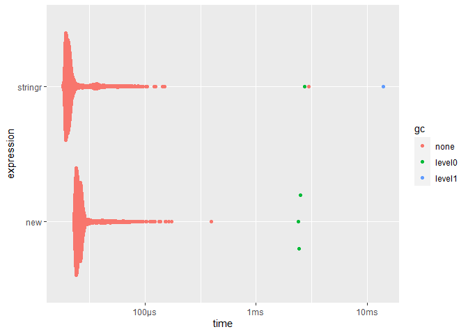
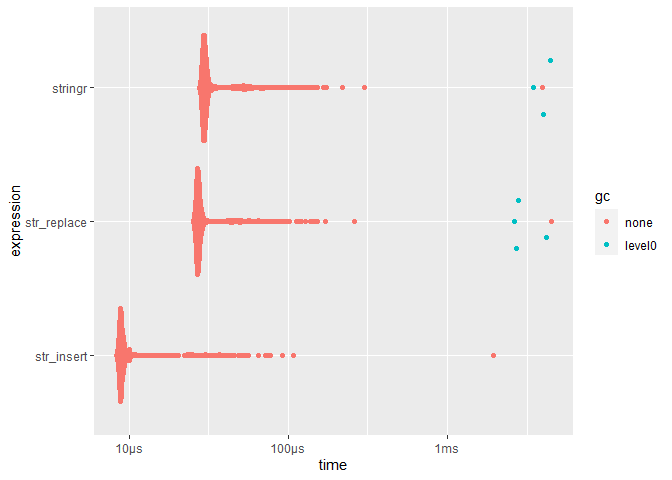
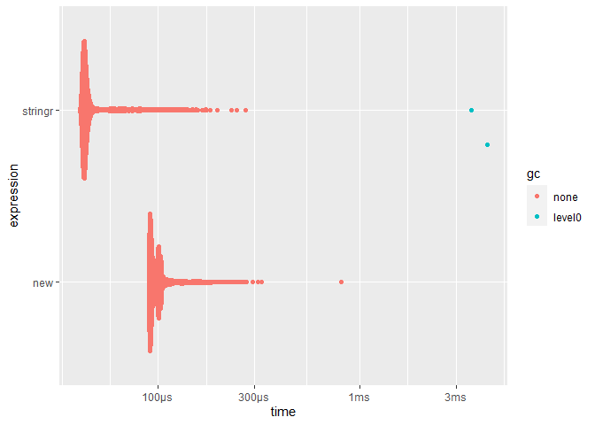
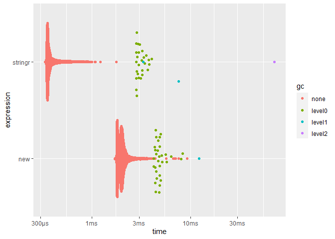
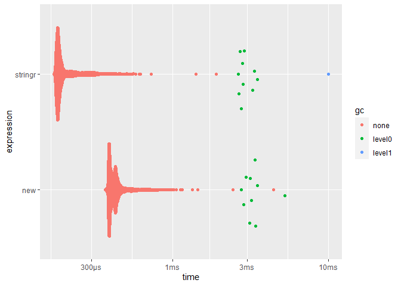
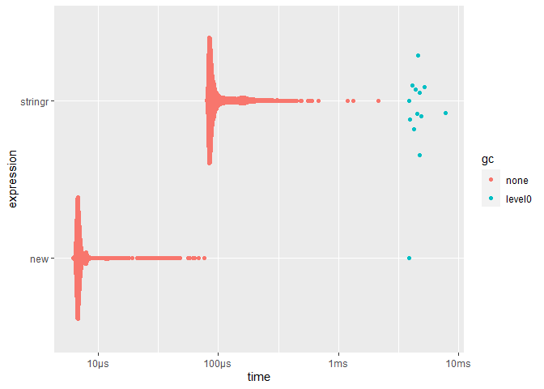
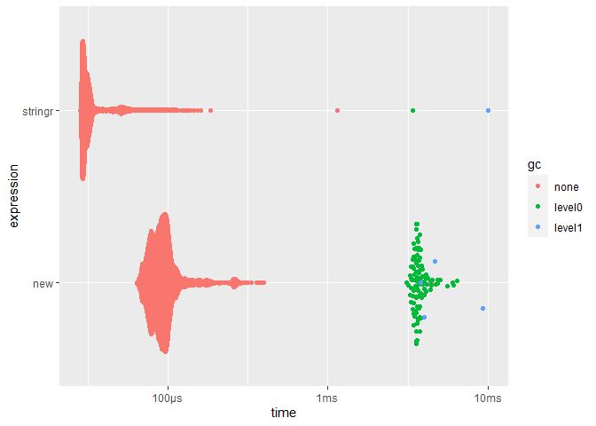
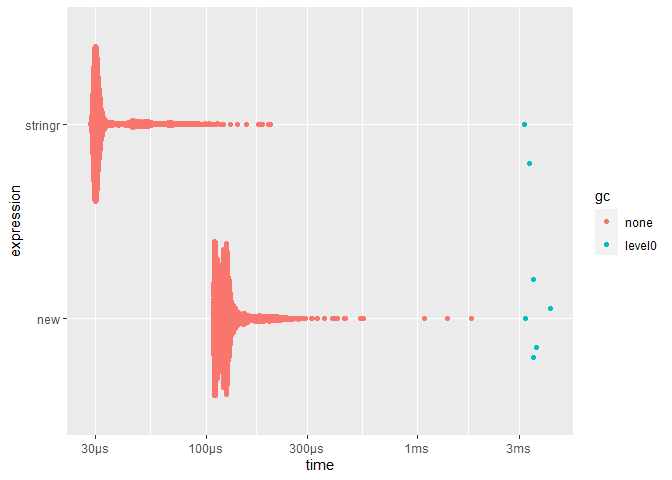
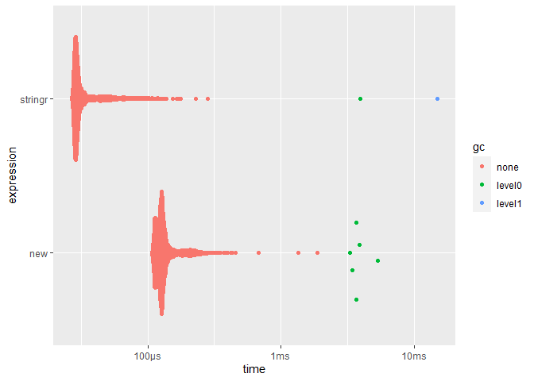

Benchmark of stringr replacement
================

- <a href="#context" id="toc-context">Context</a>
  - <a href="#session-info" id="toc-session-info">Session info</a>
  - <a href="#helpers" id="toc-helpers">Helpers</a>
- <a href="#benchmarking" id="toc-benchmarking">Benchmarking</a>
  - <a href="#stringrstr_replace_all"
    id="toc-stringrstr_replace_all"><code>stringr::str_replace_all()</code></a>
  - <a href="#stringrstr_trim"
    id="toc-stringrstr_trim"><code>stringr::str_trim()</code></a>
  - <a href="#stringrstr_dup"
    id="toc-stringrstr_dup"><code>stringr::str_dup()</code></a>
  - <a href="#stringrstr_split"
    id="toc-stringrstr_split"><code>stringr::str_split()</code></a>
  - <a href="#stringrstr_sub"
    id="toc-stringrstr_sub"><code>stringr::str_sub()</code></a>
  - <a href="#variant-replacement-str_insert-instead-or-str_replace"
    id="toc-variant-replacement-str_insert-instead-or-str_replace">Variant
    replacement <code>str_insert()</code> instead or
    <code>str_replace()</code></a>
  - <a href="#stringrstr_detect"
    id="toc-stringrstr_detect"><code>stringr::str_detect()</code></a>
  - <a href="#stringrstr_wrap"
    id="toc-stringrstr_wrap"><code>stringr::str_wrap()</code></a>
  - <a href="#stringrstr_pad"
    id="toc-stringrstr_pad"><code>stringr::str_pad()</code></a>
  - <a href="#stringrstr_count"
    id="toc-stringrstr_count"><code>stringr::str_count()</code></a>
  - <a href="#stringrstr_extract_all"
    id="toc-stringrstr_extract_all"><code>stringr::str_extract_all</code></a>
  - <a href="#stringrstr_locate"
    id="toc-stringrstr_locate"><code>stringr::str_locate()</code></a>
  - <a href="#stringrstr_locate_all"
    id="toc-stringrstr_locate_all"><code>stringr::str_locate_all()</code></a>
  - <a href="#stringrstr_match_all"
    id="toc-stringrstr_match_all"><code>stringr::str_match_all()</code></a>

# Context

As part of [\#1549](https://github.com/yihui/knitr/issues/1549), we
removed **stringr** dependency by replacing all functions used with base
R equivalent.

This document aim to be a benchmark of each replacement. We’ll use
[**bench**](https://bench.r-lib.org/) to do the benchmark, and compare
**stringr** function with its replacement. Each benchmark will be done
in the context of there initial usage in **knitr**.

## Session info

``` r
xfun::session_info(c("knitr", "bench", "stringr"))
```

    ## R version 4.2.0 (2022-04-22 ucrt)
    ## Platform: x86_64-w64-mingw32/x64 (64-bit)
    ## Running under: Windows 10 x64 (build 22621)
    ## 
    ## Locale:
    ##   LC_COLLATE=French_France.utf8  LC_CTYPE=French_France.utf8   
    ##   LC_MONETARY=French_France.utf8 LC_NUMERIC=C                  
    ##   LC_TIME=French_France.utf8    
    ## 
    ## Package version:
    ##   bench_1.1.2     cli_3.6.0       evaluate_0.20   fansi_1.0.3    
    ##   glue_1.6.2      graphics_4.2.0  grDevices_4.2.0 highr_0.10     
    ##   knitr_1.41.9    lifecycle_1.0.3 magrittr_2.0.3  methods_4.2.0  
    ##   pillar_1.8.1    pkgconfig_2.0.3 profmem_0.6.0   rlang_1.0.6    
    ##   stats_4.2.0     stringi_1.7.12  stringr_1.5.0   tibble_3.1.8   
    ##   tools_4.2.0     utf8_1.2.2      utils_4.2.0     vctrs_0.5.1    
    ##   xfun_0.36       yaml_2.3.6

## Helpers

``` r
knitr_example = function(...) system.file('examples', ..., package = 'knitr')
```

# Benchmarking

## `stringr::str_replace_all()`

| Commit                                                                                     | PR                                                 | File                                                                                                                            |
|--------------------------------------------------------------------------------------------|----------------------------------------------------|---------------------------------------------------------------------------------------------------------------------------------|
| [9c92eff1](https://github.com/yihui/knitr/commit/9c92eff1f22b1e6c3bf5dc538dd8c0a2edc8ad48) | [\#2174](https://github.com/yihui/knitr/pull/2174) | [utils-vignettes.R#L158](https://github.com/yihui/knitr/blob/9c92eff1f22b1e6c3bf5dc538dd8c0a2edc8ad48/R/utils-vignettes.R#L158) |

Before:

``` r
x[!i] = stringr::str_replace_all(x[!i], p$inline.code, '') # remove inline code
```

After:

``` r
x[!i] = gsub(p$inline.code, '', x[!i], perl = TRUE) # remove inline code
```

``` r
file = knitr_example('knitr-minimal.Rnw')
x = xfun::read_utf8(file)
p = knitr:::detect_pattern(x, tolower(xfun::file_ext(file)))
p = knitr:::all_patterns[[p]]
p1 = p$chunk.begin; p2  = p$chunk.end
m = knitr:::group_indices(grepl(p1, x), grepl(p2, x))
i = m %% 2 == 0
```

``` r
res = bench::mark(
  stringr = stringr::str_replace_all(x[!i], p$inline.code, ''),
  new = gsub(p$inline.code, '', x[!i], perl = TRUE),
  min_time = Inf
)
summary(res, relative = TRUE)
```

    ## # A tibble: 2 × 6
    ##   expression   min median `itr/sec` mem_alloc `gc/sec`
    ##   <bch:expr> <dbl>  <dbl>     <dbl>     <dbl>    <dbl>
    ## 1 stringr     1.42   1.47      1        1226.     5.31
    ## 2 new         1      1         1.51        1      1

``` r
ggplot2::autoplot(res)
```

    ## Le chargement a nécessité le package : tidyr

<!-- -->

## `stringr::str_trim()`

<table style="width:100%;">
<colgroup>
<col style="width: 35%" />
<col style="width: 20%" />
<col style="width: 43%" />
</colgroup>
<thead>
<tr class="header">
<th>Commit</th>
<th>PR</th>
<th>File</th>
</tr>
</thead>
<tbody>
<tr class="odd">
<td><a
href="https://github.com/yihui/knitr/commit/8fa7d1710bae72f9636ef64fa9286669329f1a9c">8fa7d17</a></td>
<td><a href="https://github.com/yihui/knitr/pull/2177">#2177</a></td>
<td><p><a
href="https://github.com/yihui/knitr/blob/8fa7d1710bae72f9636ef64fa9286669329f1a9c/R/parser.R#L491">parser.R#L491</a></p>
<p><a
href="https://github.com/yihui/knitr/blob/8fa7d1710bae72f9636ef64fa9286669329f1a9c/R/utils.R#L77">utils.R#L77</a></p></td>
</tr>
</tbody>
</table>

Before:

``` r
labels = stringr::str_trim(gsub(lab, '\\3', sapply(groups, `[`, 1)))
```

After:

``` r
x[!i] = gsub(p$inline.code, '', x[!i], perl = TRUE) # remove inline code
```

``` r
path = "https://raw.githubusercontent.com/yihui/knitr-examples/46c8d1db0cf0c9ab04432444079927324c4c3688/113-foo.R"
lines = xfun::read_utf8(path)
lab = knitr:::.sep.label
idx = cumsum(grepl(lab, lines))
groups = unname(split(lines, idx))
```

``` r
content = gsub(lab, '\\3', sapply(groups, `[`, 1))

res = bench::mark(
  stringr = stringr::str_trim(content),
  new = trimws(content),
  min_time = Inf
)
summary(res, relative = TRUE)
```

    ## # A tibble: 2 × 6
    ##   expression   min median `itr/sec` mem_alloc `gc/sec`
    ##   <bch:expr> <dbl>  <dbl>     <dbl>     <dbl>    <dbl>
    ## 1 stringr     1      1         2.43       Inf     8.11
    ## 2 new         2.54   2.53      1          NaN     1

``` r
ggplot2::autoplot(res)
```

<!-- -->

| Commit                                                                                    | PR                                                 | File                                                                                                      |
|-------------------------------------------------------------------------------------------|----------------------------------------------------|-----------------------------------------------------------------------------------------------------------|
| [8fa7d17](https://github.com/yihui/knitr/commit/8fa7d1710bae72f9636ef64fa9286669329f1a9c) | [\#2177](https://github.com/yihui/knitr/pull/2177) | [utils.R#L77](https://github.com/yihui/knitr/blob/8fa7d1710bae72f9636ef64fa9286669329f1a9c/R/utils.R#L77) |

Before:

``` r
stringr::str_trim(stringr::str_split(string, ';|,')[[1]])
```

After:

``` r
trimws(stringr::str_split(string, ';|,')[[1]])
```

``` r
string = ' .5,.6 , .7; .9 '
splitted = stringr::str_split(string, ';|,')[[1]]

res = bench::mark(
  stringr = stringr::str_trim(splitted),
  new = trimws(splitted),
  min_time = Inf
)
summary(res, relative = TRUE)
```

    ## # A tibble: 2 × 6
    ##   expression   min median `itr/sec` mem_alloc `gc/sec`
    ##   <bch:expr> <dbl>  <dbl>     <dbl>     <dbl>    <dbl>
    ## 1 stringr     1      1         2.44       Inf     8.15
    ## 2 new         2.53   2.55      1          NaN     1

``` r
ggplot2::autoplot(res)
```

<!-- -->

## `stringr::str_dup()`

| Commit                                                                                    | PR                                                 | File                                                                                                            |
|-------------------------------------------------------------------------------------------|----------------------------------------------------|-----------------------------------------------------------------------------------------------------------------|
| [1ce8286](https://github.com/yihui/knitr/commit/1ce82862b689338ce275269056ebfcc96eb975ca) | [\#2186](https://github.com/yihui/knitr/pull/2186) | [parser.R#L3488](https://github.com/yihui/knitr/blob/1ce82862b689338ce275269056ebfcc96eb975ca/R/parser.R#L3488) |

Before:

``` r
cat(' ', stringr::str_dup('~', getOption('width') - 10L), '\n')
```

After:

``` r
rep_str = function(x, n, sep = '') paste(rep(x, n), collapse = sep)
cat(' ', rep_str('~', getOption('width') - 10L), '\n')
```

``` r
res = bench::mark(
  stringr = stringr::str_dup('~', getOption('width') - 10L),
  new = paste(rep('~', getOption('width') - 10L), collapse = ''),
  min_time = Inf
)
summary(res, relative = TRUE)
```

    ## # A tibble: 2 × 6
    ##   expression   min median `itr/sec` mem_alloc `gc/sec`
    ##   <bch:expr> <dbl>  <dbl>     <dbl>     <dbl>    <dbl>
    ## 1 stringr     1      1         1.15      5.96      Inf
    ## 2 new         1.21   1.15      1         1         NaN

``` r
ggplot2::autoplot(res)
```

<!-- -->

## `stringr::str_split()`

<table style="width:100%;">
<colgroup>
<col style="width: 35%" />
<col style="width: 20%" />
<col style="width: 43%" />
</colgroup>
<thead>
<tr class="header">
<th>Commit</th>
<th>PR</th>
<th>File</th>
</tr>
</thead>
<tbody>
<tr class="odd">
<td><a
href="https://github.com/yihui/knitr/commit/67b973dc87c9d479cd5fbd76806e3a91f5e7d18c">67b973</a></td>
<td><a href="https://github.com/yihui/knitr/pull/2187">#2187</a></td>
<td><p><a
href="https://github.com/yihui/knitr/blob/67b973dc87c9d479cd5fbd76806e3a91f5e7d18c/R/pandoc.R#L125">pandoc.R#L125</a></p>
<p><a
href="https://github.com/yihui/knitr/blob/67b973dc87c9d479cd5fbd76806e3a91f5e7d18c/R/utils.R#L77">utils.R#L77</a></p></td>
</tr>
</tbody>
</table>

Before:

``` r
x = stringr::str_split(x, '\n')
```

After:

``` r
# patch strsplit() to split '' into '' instead of character(0)
str_split = function(x, split, ...) {
  y = strsplit(x, split, ...)
  y[x == ''] = list('')
  y
}

x = str_split(x, '\n')
```

``` r
con = url("https://raw.githubusercontent.com/yihui/knitr-examples/46c8d1db0cf0c9ab04432444079927324c4c3688/084-pandoc.pandoc")
x = read.dcf(con)
close(con)
x = x[!is.na(x)]
```

``` r
str_split = function(x, split, ...) {
  y = strsplit(x, split, ...)
  y[x == ''] = list('')
  y
}
res = bench::mark(
  stringr = stringr::str_split(x, '\n'),
  new = str_split(x, '\n'),
  min_time = Inf
)
summary(res, relative = TRUE)
```

    ## # A tibble: 2 × 6
    ##   expression   min median `itr/sec` mem_alloc `gc/sec`
    ##   <bch:expr> <dbl>  <dbl>     <dbl>     <dbl>    <dbl>
    ## 1 stringr     2.51   2.45      1         2.38     1   
    ## 2 new         1      1         2.32      1        1.16

``` r
ggplot2::autoplot(res)
```

<!-- -->

## `stringr::str_sub()`

<table style="width:100%;">
<colgroup>
<col style="width: 35%" />
<col style="width: 19%" />
<col style="width: 44%" />
</colgroup>
<thead>
<tr class="header">
<th>Commit</th>
<th>PR</th>
<th>File</th>
</tr>
</thead>
<tbody>
<tr class="odd">
<td><a
href="https://github.com/yihui/knitr/commit/5a2cb72f63aa64b757418df99fc2ad3ef5292ac0">5a2cb72</a></td>
<td><a href="https://github.com/yihui/knitr/pull/2195">#2195</a></td>
<td><a
href="https://github.com/yihui/knitr/blob/5a2cb72f63aa64b757418df99fc2ad3ef5292ac0/R/utils-string.R">utils-string.R</a><br />
<a
href="https://github.com/yihui/knitr/blob/5a2cb72f63aa64b757418df99fc2ad3ef5292ac0/R/block.R#L564">block.R#L564</a><br />
<a
href="https://github.com/yihui/knitr/blob/5a2cb72f63aa64b757418df99fc2ad3ef5292ac0/R/utils.R#L92-L93">utils.R#L92-L93</a></td>
</tr>
</tbody>
</table>

Before:

``` r
stringr::str_sub(input, loc[i, 1], loc[i, 2]) = if (length(res)) {
      paste(hook(res), collapse = '')
    } else ''
```

After:

``` r
# replace parts of a string with new values; `pos` is a matrix of positions and
# each row is a pair of [start, end]
str_replace = function(x, pos, value) {
  if (length(x) != 1) stop("Only a character scalar is supported.")
  # extract parts of the string that are outside [start, end]
  m = rbind(pos[, 1] - 1, pos[, 2] + 1)
  m = matrix(c(1, m, nchar(x)), nrow = 2)
  y = substring(x, m[1, ], m[2, ])
  paste(rbind(y, c(value, '')), collapse = '')
}

str_replace(input, block$location, ans)
```

``` r
input = "inline `r (function() 1)()`"
location = matrix(c(8,27), ncol = 2, byrow = TRUE)
ans = "1"

str_replace = function(x, pos, value) {
  if (length(x) != 1) stop("Only a character scalar is supported.")
  # extract parts of the string that are outside [start, end]
  m = rbind(pos[, 1] - 1, pos[, 2] + 1)
  m = matrix(c(1, m, nchar(x)), nrow = 2)
  y = substring(x, m[1, ], m[2, ])
  paste(rbind(y, c(value, '')), collapse = '')
}

# wrapper to approximate what is done internally
old_replace = function(input, loc, ans) {
  stringr::str_sub(input, loc[1, 1], loc[1, 2]) = ans
  return(input)
}
```

``` r
res = bench::mark(
  stringr = old_replace(input, location, ans),
  new = str_replace(input, location, ans),
  min_time = Inf
)
summary(res, relative = TRUE)
```

    ## # A tibble: 2 × 6
    ##   expression   min median `itr/sec` mem_alloc `gc/sec`
    ##   <bch:expr> <dbl>  <dbl>     <dbl>     <dbl>    <dbl>
    ## 1 stringr     1      1         1.36      9.19     1.36
    ## 2 new         1.23   1.24      1         1        1

``` r
ggplot2::autoplot(res)
```

<!-- -->

<table style="width:100%;">
<colgroup>
<col style="width: 34%" />
<col style="width: 19%" />
<col style="width: 45%" />
</colgroup>
<thead>
<tr class="header">
<th>Commit</th>
<th>PR</th>
<th>File</th>
</tr>
</thead>
<tbody>
<tr class="odd">
<td><a
href="https://github.com/yihui/knitr/commit/5a2cb72f63aa64b757418df99fc2ad3ef5292ac0">5a2cb72</a></td>
<td><a href="https://github.com/yihui/knitr/pull/2195">#2195</a></td>
<td><a
href="https://github.com/yihui/knitr/blob/5a2cb72f63aa64b757418df99fc2ad3ef5292ac0/R/header.R#L59-L60">header.R#L59-L60</a><br />
<a
href="https://github.com/yihui/knitr/blob/5a2cb72f63aa64b757418df99fc2ad3ef5292ac0/R/header.R#L90-L91">header.R#L90-L91</a></td>
</tr>
</tbody>
</table>

Before:

``` r
tmp = stringr::str_sub(doc[i], l[, 1], l[, 2])
stringr::str_sub(doc[i], l[,1], l[,2]) = paste0(tmp, '\n', make_header_html())
```

After :

``` r
tmp = substr(doc[i], l[, 1], l[, 2])
doc[i] = str_replace(doc[i], l, paste0(tmp, '\n', make_header_html()))
```

``` r
b = knitr::all_patterns$html$header.begin
doc = c("<head>", "<!--content-->", "</head>", "<body>", "</body>")
i = grep(b, doc)
l = stringr::str_locate(doc[i], b)
```

``` r
res = bench::mark(
  stringr = stringr::str_sub(doc[i], l[, 1], l[, 2]),
  new = substr(doc[i], l[, 1], l[, 2]),
  min_time = Inf
)
summary(res, relative = TRUE)
```

    ## # A tibble: 2 × 6
    ##   expression   min median `itr/sec` mem_alloc `gc/sec`
    ##   <bch:expr> <dbl>  <dbl>     <dbl>     <dbl>    <dbl>
    ## 1 stringr     3.77   3.53      1          Inf     1   
    ## 2 new         1      1         3.73       NaN     3.73

``` r
ggplot2::autoplot(res)
```

<!-- -->

``` r
tmp = stringr::str_sub(doc[i], l[, 1], l[, 2])
header = knitr:::make_header_html()

old_fun = function(doc, l, tmp, header) {
  stringr::str_sub(doc[i], l[,1], l[,2]) = paste0(tmp, header)
  doc
}

new_fun = function(doc, l, tmp, header) {
  doc[i] = str_replace(doc[i], l, paste0(tmp, header))
  doc
}

res = bench::mark(
  stringr = old_fun(doc, l, tmp, header),
  new = new_fun(doc, l, tmp, header),
  min_time = Inf
)
summary(res, relative = TRUE)
```

    ## # A tibble: 2 × 6
    ##   expression   min median `itr/sec` mem_alloc `gc/sec`
    ##   <bch:expr> <dbl>  <dbl>     <dbl>     <dbl>    <dbl>
    ## 1 stringr     1      1         1.14       Inf     1   
    ## 2 new         1.16   1.16      1          NaN     1.32

``` r
ggplot2::autoplot(res)
```

<!-- -->

Before:

``` r
tmp = stringr::str_sub(doc[i], l[, 1], l[, 2])
stringr::str_sub(doc[i], l[,1], l[,2]) = paste0(tmp, make_header_latex(doc))
```

After :

``` r
tmp = substr(doc[i], l[, 1], l[, 2])
doc[i] = str_replace(doc[i], l, paste0(tmp, make_header_latex(doc)))
```

``` r
b = knitr::all_patterns$tex$header.begin
doc = c("\\documentclass[opt]{article}", "some tex content")
i = grep(b, doc)
l = stringr::str_locate(doc[i], b)
```

``` r
res = bench::mark(
  stringr = stringr::str_sub(doc[i], l[, 1], l[, 2]),
  new = substr(doc[i], l[, 1], l[, 2]),
  min_time = Inf
)
summary(res, relative = TRUE)
```

    ## # A tibble: 2 × 6
    ##   expression   min median `itr/sec` mem_alloc `gc/sec`
    ##   <bch:expr> <dbl>  <dbl>     <dbl>     <dbl>    <dbl>
    ## 1 stringr     3.55   3.42      1          Inf     1   
    ## 2 new         1      1         3.48       NaN     3.48

``` r
ggplot2::autoplot(res)
```

<!-- -->

``` r
tmp = stringr::str_sub(doc[i], l[, 1], l[, 2])
header = knitr:::make_header_latex(doc)

old_fun = function(doc, l, tmp, header) {
  stringr::str_sub(doc[i], l[,1], l[,2]) = paste0(tmp, header)
  doc
}

new_fun = function(doc, l, tmp, header) {
  doc[i] = str_replace(doc[i], l, paste0(tmp, header))
  doc
}

res = bench::mark(
  stringr = old_fun(doc, l, tmp, header),
  new = new_fun(doc, l, tmp, header),
  min_time = Inf
)
summary(res, relative = TRUE)
```

    ## # A tibble: 2 × 6
    ##   expression   min median `itr/sec` mem_alloc `gc/sec`
    ##   <bch:expr> <dbl>  <dbl>     <dbl>     <dbl>    <dbl>
    ## 1 stringr     1      1         1.23       Inf     1   
    ## 2 new         1.22   1.25      1          NaN     1.22

``` r
ggplot2::autoplot(res)
```

<!-- -->

## Variant replacement `str_insert()` instead or `str_replace()`

<table style="width:100%;">
<colgroup>
<col style="width: 34%" />
<col style="width: 19%" />
<col style="width: 45%" />
</colgroup>
<thead>
<tr class="header">
<th>Commit</th>
<th>PR</th>
<th>File</th>
</tr>
</thead>
<tbody>
<tr class="odd">
<td><a
href="https://github.com/yihui/knitr/commit/5a2cb72f63aa64b757418df99fc2ad3ef5292ac0">5a2cb72</a></td>
<td><a href="https://github.com/yihui/knitr/pull/2195">#2195</a></td>
<td><a
href="https://github.com/yihui/knitr/blob/5a2cb72f63aa64b757418df99fc2ad3ef5292ac0/R/header.R#L59-L60">header.R#L59-L60</a><br />
<a
href="https://github.com/yihui/knitr/blob/5a2cb72f63aa64b757418df99fc2ad3ef5292ac0/R/header.R#L90-L91">header.R#L90-L91</a></td>
</tr>
</tbody>
</table>

Before:

``` r
tmp = stringr::str_sub(doc[i], l[, 1], l[, 2])
stringr::str_sub(doc[i], l[,1], l[,2]) = paste0(tmp, '\n', make_header_html())
```

After :

``` r
doc[i] = str_insert(doc[i], l[, 2], paste0('\n', make_header_html()))
```

``` r
b = knitr::all_patterns$html$header.begin
doc = c("<head>", "<!--content-->", "</head>", "<body>", "</body>")
i = grep(b, doc)
l = stringr::str_locate(doc[i], b)
```

``` r
header = knitr:::make_header_html()

str_insert = function(x, i, value) {
  if (i <= 0) return(paste0(value, x))
  n = nchar(x)
  if (n == 0 || i >= n) return(paste0(x, value))
  paste0(substr(x, 1, i), value, substr(x, i + 1, n))
}

old_str_sub = function(doc, l, header) {
  tmp = stringr::str_sub(doc[i], l[, 1], l[, 2])
  stringr::str_sub(doc[i], l[,1], l[,2]) = paste0(tmp, header)
  doc
}

new_str_replace = function(doc, l, header) {
  tmp = substr(doc[i], l[, 1], l[, 2])
  doc[i] = str_replace(doc[i], l, paste0(tmp, header))
  doc
}

new_str_insert = function(doc, l, header) {
  doc[i] = str_insert(doc[i], l[, 2], paste0('\n', header))
  doc
}

res = bench::mark(
  stringr = old_str_sub(doc, l, header),
  str_replace = new_str_replace(doc, l, header),
  str_insert = new_str_insert(doc, l, header),
  min_time = Inf,
  # we get a small difference in output
  check = FALSE
)
summary(res, relative = TRUE)
```

    ## # A tibble: 3 × 6
    ##   expression    min median `itr/sec` mem_alloc `gc/sec`
    ##   <bch:expr>  <dbl>  <dbl>     <dbl>     <dbl>    <dbl>
    ## 1 stringr      2.89   2.86      1          Inf     1.06
    ## 2 str_replace  2.40   2.45      1.19       NaN     1.69
    ## 3 str_insert   1      1         2.83       NaN     1

``` r
ggplot2::autoplot(res)
```

<!-- -->

Special edge case here: Our replacement function is not completely
equivalent.

- New version gives `<head>\n<style type="text/css">\n\n</style>`
- stringr version gives `<head><style type="text/css">\n\n</style>`

Before:

``` r
tmp = stringr::str_sub(doc[i], l[, 1], l[, 2])
stringr::str_sub(doc[i], l[,1], l[,2]) = paste0(tmp, make_header_latex(doc))
```

After :

``` r
doc[i] = str_insert(doc[i], l[, 2], make_header_latex(doc))
```

``` r
b = knitr::all_patterns$tex$header.begin
doc = c("\\documentclass[opt]{article}", "some tex content")
i = grep(b, doc)
l = stringr::str_locate(doc[i], b)
```

``` r
header = knitr:::make_header_latex(doc)

old_str_sub = function(doc, l, header) {
  tmp = stringr::str_sub(doc[i], l[, 1], l[, 2])
  stringr::str_sub(doc[i], l[,1], l[,2]) = paste0(tmp, header)
  doc
}

new_str_replace = function(doc, l, header) {
  tmp = substr(doc[i], l[, 1], l[, 2])
  doc[i] = str_replace(doc[i], l, paste0(tmp, header))
  doc
}

new_str_insert = function(doc, l, header) {
  doc[i] = str_insert(doc[i], l[, 2], header)
  doc
}

res = bench::mark(
  stringr = old_str_sub(doc, l, header),
  str_replace = new_str_replace(doc, l, header),
  str_insert = new_str_insert(doc, l, header),
  min_time = Inf
)

summary(res, relative = TRUE)
```

    ## # A tibble: 3 × 6
    ##   expression    min median `itr/sec` mem_alloc `gc/sec`
    ##   <bch:expr>  <dbl>  <dbl>     <dbl>     <dbl>    <dbl>
    ## 1 stringr      3.24   3.23      1          Inf      Inf
    ## 2 str_replace  2.93   2.89      1.16       NaN      Inf
    ## 3 str_insert   1      1         3.35       NaN      NaN

``` r
ggplot2::autoplot(res)
```

<!-- -->

## `stringr::str_detect()`

| Commit                                                                                    | PR                                                 | File                                                                                                          |
|-------------------------------------------------------------------------------------------|----------------------------------------------------|---------------------------------------------------------------------------------------------------------------|
| [1a0f2cc](https://github.com/yihui/knitr/commit/1a0f2cc269c6a7f86f10b77d12229a80c14d6ee6) | [\#2202](https://github.com/yihui/knitr/pull/2202) | [pandoc.R#L125](https://github.com/yihui/knitr/blob/67b973dc87c9d479cd5fbd76806e3a91f5e7d18c/R/pandoc.R#L125) |

Before:

``` r
if (length(pat) && any(stringr::str_detect(text, pat))) return(p)
```

After:

``` r
if (length(pat) && any(grepl(pat, text, perl = TRUE))) return(p)
```

``` r
pat = knitr:::all_patterns$md$chunk.begin
text = xfun::read_utf8(knitr_example("knitr-spin.Rmd"))
```

``` r
res = bench::mark(
  stringr = stringr::str_detect(text, pat),
  new = grepl(pat, text, perl = TRUE),
  min_time = Inf
)
summary(res, relative = TRUE)
```

    ## # A tibble: 2 × 6
    ##   expression   min median `itr/sec` mem_alloc `gc/sec`
    ##   <bch:expr> <dbl>  <dbl>     <dbl>     <dbl>    <dbl>
    ## 1 stringr     1      1         2.08      76.1      Inf
    ## 2 new         2.16   2.16      1          1        NaN

``` r
ggplot2::autoplot(res)
```

<!-- -->

## `stringr::str_wrap()`

| Commit                                                                                    | PR                                                 | File                                                                                                              |
|-------------------------------------------------------------------------------------------|----------------------------------------------------|-------------------------------------------------------------------------------------------------------------------|
| [1a0f2cc](https://github.com/yihui/knitr/commit/1a0f2cc269c6a7f86f10b77d12229a80c14d6ee6) | [\#2202](https://github.com/yihui/knitr/pull/2202) | [citation.R#L135](https://github.com/yihui/knitr/blob/1a0f2cc269c6a7f86f10b77d12229a80c14d6ee6/R/citation.R#L135) |

Before:

``` r
b[-idx] = stringr::str_wrap(b[-idx], width, 2, 4)
```

After:

``` r
str_wrap = function(...) {
  res = strwrap(..., simplify = FALSE)
  unlist(lapply(res, one_string))
  }
b[-idx] = str_wrap(b[-idx], width, 2, 4)
```

``` r
x = "knitr"
lib.loc = NULL
tweak = TRUE
prefix = 'R-'
.tweak.bib = knitr:::.tweak.bib
citation = function(...) utils::citation(..., lib.loc = lib.loc)
bib = sapply(x, function(pkg) {
  cite = citation(pkg, auto = if (pkg != 'base') {
    meta = packageDescription(pkg, lib.loc = lib.loc)
    # don't use the CRAN URL if the package has provided its own URL
    if (identical(meta$Repository, 'CRAN') && !is.null(meta$URL)) {
      # however, the package may have provided multiple URLs, in which case we
      # still use the CRAN URL
      if (!grepl('[, ]', meta$URL)) meta$Repository = NULL
    }
    meta
  })
  entry = toBibtex(cite)
  entry[1] = sub('\\{,$', sprintf('{%s%s,', prefix, pkg), entry[1])
  entry
}, simplify = FALSE)
```

``` r
str_wrap = function(...) {
  res = strwrap(..., simplify = FALSE)
  unlist(lapply(res, knitr:::one_string))
}
res = bench::mark(
  stringr = stringr::str_wrap(bib$knitr, 20, 2, 4),
  new = str_wrap(bib$knitr, 20, 2, 4),
  min_time = Inf, 
  check = FALSE # functions are not completely equivalent
)
summary(res, relative = TRUE)
```

    ## # A tibble: 2 × 6
    ##   expression   min median `itr/sec` mem_alloc `gc/sec`
    ##   <bch:expr> <dbl>  <dbl>     <dbl>     <dbl>    <dbl>
    ## 1 stringr     1      1         5.06      1.74     4.60
    ## 2 new         5.11   5.37      1         1        1

``` r
ggplot2::autoplot(res)
```

<!-- -->

Special edge case here: Our replacement function is not completely
equivalent.

- New version gives `note = {R package\n    version\n    1.41.9},`
- stringr version gives `note = {R package\n    version 1.41.9},`

| Commit                                                                                    | PR                                                 | File                                                                                                             |
|-------------------------------------------------------------------------------------------|----------------------------------------------------|------------------------------------------------------------------------------------------------------------------|
| [1a0f2cc](https://github.com/yihui/knitr/commit/1a0f2cc269c6a7f86f10b77d12229a80c14d6ee6) | [\#2202](https://github.com/yihui/knitr/pull/2202) | [output.R#L503](https://github.com/yihui/knitr/blob/1a0f2cc269c6a7f86f10b77d12229a80c14d6ee6/R/output.R#L503) \| |

Before:

``` r
stringr::str_wrap(message, width = getOption('width'))
```

After:

``` r
str_wrap = function(...) {
  res = strwrap(..., simplify = FALSE)
  unlist(lapply(res, one_string))
  }
str_wrap(message, width = getOption('width'))
```

``` r
warn_msg = "Warning function: This is a warning message quite loooooooooooong"
```

``` r
str_wrap = function(...) {
  res = strwrap(..., simplify = FALSE)
  unlist(lapply(res, knitr:::one_string))
}
res = bench::mark(
  stringr = stringr::str_wrap(warn_msg, 10),
  new = str_wrap(warn_msg, 10),
  min_time = Inf, 
  check = FALSE # functions are not completely equivalent
)
summary(res, relative = TRUE)
```

    ## # A tibble: 2 × 6
    ##   expression   min median `itr/sec` mem_alloc `gc/sec`
    ##   <bch:expr> <dbl>  <dbl>     <dbl>     <dbl>    <dbl>
    ## 1 stringr     1      1         2.19       Inf     2.41
    ## 2 new         2.18   2.24      1          NaN     1

``` r
ggplot2::autoplot(res)
```

<!-- -->

Special edge case here: Our replacement function is not completely
equivalent.

- New version gives
  `Warning\nfunction:\nThis is\na warning\nmessage\nquite\nloooooooooooong`
- stringr version gives
  `Warning\nfunction:\nThis is a\nwarning\nmessage\nquite\nloooooooooooong`

## `stringr::str_pad()`

| Commit                                                                                    | PR                                                 | File                                                                                                        |
|-------------------------------------------------------------------------------------------|----------------------------------------------------|-------------------------------------------------------------------------------------------------------------|
| [1a0f2cc](https://github.com/yihui/knitr/commit/1a0f2cc269c6a7f86f10b77d12229a80c14d6ee6) | [\#2202](https://github.com/yihui/knitr/pull/2202) | [block.R#L619](https://github.com/yihui/knitr/blob/1a0f2cc269c6a7f86f10b77d12229a80c14d6ee6/R/block.R#L619) |

Before:

``` r
paste0('## ----', stringr::str_pad(label, max(getOption('width') - 11L, 0L), 'right', '-'), '----', code)
```

After:

``` r
paste0('## ----', label, strrep('-', max(getOption('width') - 11L - nchar(label), 0L)), '----', code)
```

``` r
label = "my-first-chunk"
```

``` r
res = bench::mark(
  stringr = paste0('## ----', stringr::str_pad(label, max(getOption('width') - 11L, 0L), 'right', '-'), '----'),
  new = paste0('## ----', label, strrep('-', max(getOption('width') - 11L - nchar(label), 0L)), '----'),
  min_time = Inf
)
summary(res, relative = TRUE)
```

    ## # A tibble: 2 × 6
    ##   expression   min median `itr/sec` mem_alloc `gc/sec`
    ##   <bch:expr> <dbl>  <dbl>     <dbl>     <dbl>    <dbl>
    ## 1 stringr     12.1   12.1       1         Inf     1.01
    ## 2 new          1      1        12.9       NaN     1

``` r
ggplot2::autoplot(res)
```

<!-- -->

## `stringr::str_count()`

| Commit                                                                                    | PR                                                 | File                                                                                                                  |
|-------------------------------------------------------------------------------------------|----------------------------------------------------|-----------------------------------------------------------------------------------------------------------------------|
| [1a0f2cc](https://github.com/yihui/knitr/commit/1a0f2cc269c6a7f86f10b77d12229a80c14d6ee6) | [\#2202](https://github.com/yihui/knitr/pull/2202) | [utils.R#L583-L590](https://github.com/yihui/knitr/blob/1a0f2cc269c6a7f86f10b77d12229a80c14d6ee6/R/utils.R#L583-L590) |

Before:

``` r
line_count_str = function(x) stringr::str_count(x, '\n') + 1L
```

After:

``` r
line_count = function(x) {
  res = gregexpr('\n', x, fixed = TRUE)
  unlist(lapply(res, function(x) {
    n = length(x)
    if (n == 1 && x == -1) n = 0
    n + 1
  }))
}
```

``` r
text = xfun::read_utf8(knitr_example("knitr-spin.Rmd"))
```

``` r
res = bench::mark(
  stringr = line_count_str(text),
  new = line_count(text),
  min_time = Inf
)
summary(res, relative = TRUE)
```

    ## # A tibble: 2 × 6
    ##   expression   min median `itr/sec` mem_alloc `gc/sec`
    ##   <bch:expr> <dbl>  <dbl>     <dbl>     <dbl>    <dbl>
    ## 1 stringr     1      1         2.84       1        1  
    ## 2 new         2.22   3.12      1         23.7     39.9

``` r
ggplot2::autoplot(res)
```

<!-- -->

## `stringr::str_extract_all`

| Commit                                                                                    | PR                                                 | File                                                                                                        |
|-------------------------------------------------------------------------------------------|----------------------------------------------------|-------------------------------------------------------------------------------------------------------------|
| [cc3b92a](https://github.com/yihui/knitr/commit/cc3b92a9f1c591a3424383e691349fdb4588d328) | [\#2205](https://github.com/yihui/knitr/pull/2205) | [block.R#L587](https://github.com/yihui/knitr/blob/cc3b92a9f1c591a3424383e691349fdb4588d328/R/block.R#L587) |

Before:

``` r
eval(parse_only(unlist(stringr::str_extract_all(code, 'read_chunk\\(([^)]+)\\)'))))
```

After:

``` r
str_extract = function(x, pattern) {
  m = gregexpr(pattern, x, perl = TRUE)
  regmatches(x, m)
}
eval(parse_only(unlist(str_extract(code, 'read_chunk\\(([^)]+)\\)'))))
```

``` r
code = "knitr::read_chunk('113-foo.R')"
```

``` r
str_extract = function(x, pattern) {
  m = gregexpr(pattern, x, perl = TRUE)
  regmatches(x, m)
}
res = bench::mark(
  stringr = stringr::str_extract_all(code, 'read_chunk\\(([^)]+)\\)'),
  new = str_extract(code, 'read_chunk\\(([^)]+)\\)'),
  min_time = Inf
)
summary(res, relative = TRUE)
```

    ## # A tibble: 2 × 6
    ##   expression   min median `itr/sec` mem_alloc `gc/sec`
    ##   <bch:expr> <dbl>  <dbl>     <dbl>     <dbl>    <dbl>
    ## 1 stringr     1      1         3.73      1        1.87
    ## 2 new         3.62   3.87      1         4.83     1

``` r
ggplot2::autoplot(res)
```

<!-- -->

| Commit                                                                                    | PR                                                 | File                                                                                                              |
|-------------------------------------------------------------------------------------------|----------------------------------------------------|-------------------------------------------------------------------------------------------------------------------|
| [cc3b92a](https://github.com/yihui/knitr/commit/cc3b92a9f1c591a3424383e691349fdb4588d328) | [\#2205](https://github.com/yihui/knitr/pull/2205) | [template.R#L123](https://github.com/yihui/knitr/blob/cc3b92a9f1c591a3424383e691349fdb4588d328/R/template.R#L123) |

Before:

``` r
mat = stringr::str_extract_all(txt, delim)[[1L]]
```

After:

``` r
str_extract = function(x, pattern) {
  m = gregexpr(pattern, x, perl = TRUE)
  regmatches(x, m)
}
mat = str_extract(txt, delim)[[1L]]
```

``` r
txt = 'This is the value of `x`: {{x}}'
delim = c('{{', '}}')
delim = gsub('([.|()\\^{}+$*?]|\\[|\\])', '\\\\\\1', delim)
delim = paste0(delim[1L], '((.|\n)+?)', delim[2L])
```

``` r
str_extract = function(x, pattern) {
  m = gregexpr(pattern, x, perl = TRUE)
  regmatches(x, m)
}
res = bench::mark(
  stringr = stringr::str_extract_all(txt, delim),
  new = str_extract(txt, delim),
  min_time = Inf
)
summary(res, relative = TRUE)
```

    ## # A tibble: 2 × 6
    ##   expression   min median `itr/sec` mem_alloc `gc/sec`
    ##   <bch:expr> <dbl>  <dbl>     <dbl>     <dbl>    <dbl>
    ## 1 stringr     1      1         3.66       1       1   
    ## 2 new         3.85   3.97      1         93.8     1.09

``` r
ggplot2::autoplot(res)
```

<!-- -->

## `stringr::str_locate()`

<table style="width:100%;">
<colgroup>
<col style="width: 35%" />
<col style="width: 20%" />
<col style="width: 43%" />
</colgroup>
<thead>
<tr class="header">
<th>Commit</th>
<th>PR</th>
<th>File</th>
</tr>
</thead>
<tbody>
<tr class="odd">
<td><a
href="https://github.com/yihui/knitr/commit/cc3b92a9f1c591a3424383e691349fdb4588d328">cc3b92a</a></td>
<td><a href="https://github.com/yihui/knitr/pull/2205">#2205</a></td>
<td><a
href="https://github.com/yihui/knitr/blob/cc3b92a9f1c591a3424383e691349fdb4588d328/R/header.R#L58">header.R#L58</a><br />
<a
href="https://github.com/yihui/knitr/blob/cc3b92a9f1c591a3424383e691349fdb4588d328/R/header.R#L89">header.R#L89</a></td>
</tr>
</tbody>
</table>

Before:

``` r
stringr::str_locate(doc[i], b)
```

After:

``` r
location = function(x) {
  len = attr(x, 'match.length')
  if (length(x) == 1 && x == -1) x = integer()
  cbind(start = x, end = x + len - 1L)
}
str_locate = function(x, pattern, all = TRUE) {
  out = (if (all) gregexpr else regexpr)(pattern, x, perl = TRUE)
  if (all) lapply(out, location) else location(out)
}
str_locate(doc[i], b, FALSE)
```

``` r
b = knitr::all_patterns$html$header.begin
doc = c("<head>", "<!--content-->", "</head>", "<body>", "</body>")
i = grep(b, doc)
location = function(x) {
  len = attr(x, 'match.length')
  if (length(x) == 1 && x == -1) x = integer()
  cbind(start = x, end = x + len - 1L)
}
str_locate = function(x, pattern, all = TRUE) {
  out = (if (all) gregexpr else regexpr)(pattern, x, perl = TRUE)
  if (all) lapply(out, location) else location(out)
}
```

``` r
res = bench::mark(
  stringr = stringr::str_locate(doc[i], b),
  new = str_locate(doc[i], b, FALSE),
  min_time = Inf
)
summary(res, relative = TRUE)
```

    ## # A tibble: 2 × 6
    ##   expression   min median `itr/sec` mem_alloc `gc/sec`
    ##   <bch:expr> <dbl>  <dbl>     <dbl>     <dbl>    <dbl>
    ## 1 stringr     1      1         3.33       1       6.65
    ## 2 new         3.42   3.54      1         75.8     1

``` r
ggplot2::autoplot(res)
```

<!-- -->

| Commit                                                                                    | PR                                                 | File                                                                                                          |
|-------------------------------------------------------------------------------------------|----------------------------------------------------|---------------------------------------------------------------------------------------------------------------|
| [cc3b92a](https://github.com/yihui/knitr/commit/cc3b92a9f1c591a3424383e691349fdb4588d328) | [\#2205](https://github.com/yihui/knitr/pull/2205) | [parser.R#L358](https://github.com/yihui/knitr/blob/cc3b92a9f1c591a3424383e691349fdb4588d328/R/parser.R#L358) |

Before:

``` r
loc = stringr::str_locate_all(input, inline.code)[[1]]
```

After:

``` r
location = function(x) {
  len = attr(x, 'match.length')
  if (length(x) == 1 && x == -1) x = integer()
  cbind(start = x, end = x + len - 1L)
}
str_locate = function(x, pattern, all = TRUE) {
  out = (if (all) gregexpr else regexpr)(pattern, x, perl = TRUE)
  if (all) lapply(out, location) else location(out)
}
loc = str_locate(input, inline.code)[[1]]
```

``` r
input = 'Inline expressions such as `r "the following"`'
inline.code = knitr:::all_patterns$md$inline.code
```

``` r
res = bench::mark(
  stringr = stringr::str_locate_all(input, inline.code),
  new = str_locate(input, inline.code),
  min_time = Inf
)
summary(res, relative = TRUE)
```

    ## # A tibble: 2 × 6
    ##   expression   min median `itr/sec` mem_alloc `gc/sec`
    ##   <bch:expr> <dbl>  <dbl>     <dbl>     <dbl>    <dbl>
    ## 1 stringr     1      1         3.13      1        1   
    ## 2 new         3.30   3.24      1         1.63     1.28

``` r
ggplot2::autoplot(res)
```

<!-- -->

| Commit                                                                                    | PR                                                 | File                                                                                                      |
|-------------------------------------------------------------------------------------------|----------------------------------------------------|-----------------------------------------------------------------------------------------------------------|
| [cc3b92a](https://github.com/yihui/knitr/commit/cc3b92a9f1c591a3424383e691349fdb4588d328) | [\#2205](https://github.com/yihui/knitr/pull/2205) | [utils.R#L94](https://github.com/yihui/knitr/blob/cc3b92a9f1c591a3424383e691349fdb4588d328/R/utils.R#L94) |

Before:

``` r
idx = stringr::str_locate(txt, hb) # locate documentclass
```

After:

``` r
location = function(x) {
  len = attr(x, 'match.length')
  if (length(x) == 1 && x == -1) x = integer()
  cbind(start = x, end = x + len - 1L)
}
str_locate = function(x, pattern, all = TRUE) {
  out = (if (all) gregexpr else regexpr)(pattern, x, perl = TRUE)
  if (all) lapply(out, location) else location(out)
}
idx = str_locate(txt, hb, FALSE) # locate documentclass
```

``` r
input = xfun::read_utf8(knitr_example("child/knitr-main.Rnw"))
patterns = knitr:::all_patterns$tex
db = patterns$document.begin
hb = patterns$header.begin
idx2 = grep(db, input)[1]
idx1 = grep(hb, input)[1]
txt = knitr:::one_string(input[idx1:(idx2 - 1L)])
```

``` r
location = function(x) {
  len = attr(x, 'match.length')
  if (length(x) == 1 && x == -1) x = integer()
  cbind(start = x, end = x + len - 1L)
}
str_locate = function(x, pattern, all = TRUE) {
  out = (if (all) gregexpr else regexpr)(pattern, x, perl = TRUE)
  if (all) lapply(out, location) else location(out)
}
res = bench::mark(
  stringr = stringr::str_locate(txt, hb),
  new = str_locate(txt, hb, FALSE),
  min_time = Inf
)
summary(res, relative = TRUE)
```

    ## # A tibble: 2 × 6
    ##   expression   min median `itr/sec` mem_alloc `gc/sec`
    ##   <bch:expr> <dbl>  <dbl>     <dbl>     <dbl>    <dbl>
    ## 1 stringr     1      1         3.20       Inf     6.40
    ## 2 new         3.12   3.39      1          NaN     1

``` r
ggplot2::autoplot(res)
```

<!-- -->

## `stringr::str_locate_all()`

| Commit                                                                                    | PR                                                 | File                                                                                                              |
|-------------------------------------------------------------------------------------------|----------------------------------------------------|-------------------------------------------------------------------------------------------------------------------|
| [cc3b92a](https://github.com/yihui/knitr/commit/cc3b92a9f1c591a3424383e691349fdb4588d328) | [\#2205](https://github.com/yihui/knitr/pull/2205) | [template.R#L121](https://github.com/yihui/knitr/blob/cc3b92a9f1c591a3424383e691349fdb4588d328/R/template.R#L121) |

Before:

``` r
loc = stringr::str_locate_all(txt, delim)[[1L]]
```

After:

``` r
location = function(x) {
  len = attr(x, 'match.length')
  if (length(x) == 1 && x == -1) x = integer()
  cbind(start = x, end = x + len - 1L)
}
str_locate = function(x, pattern, all = TRUE) {
  out = (if (all) gregexpr else regexpr)(pattern, x, perl = TRUE)
  if (all) lapply(out, location) else location(out)
}
loc = str_locate(txt, delim)[[1L]]
```

``` r
txt = 'This is the value of `x`: {{x}}'
delim = c('{{', '}}')
delim = gsub('([.|()\\^{}+$*?]|\\[|\\])', '\\\\\\1', delim)
delim = paste0(delim[1L], '((.|\n)+?)', delim[2L])
location = function(x) {
  len = attr(x, 'match.length')
  if (length(x) == 1 && x == -1) x = integer()
  cbind(start = x, end = x + len - 1L)
}
str_locate = function(x, pattern, all = TRUE) {
  out = (if (all) gregexpr else regexpr)(pattern, x, perl = TRUE)
  if (all) lapply(out, location) else location(out)
}
```

``` r
res = bench::mark(
  stringr = stringr::str_locate_all(txt, delim),
  new = str_locate(txt, delim),
  min_time = Inf
)
summary(res, relative = TRUE)
```

    ## # A tibble: 2 × 6
    ##   expression   min median `itr/sec` mem_alloc `gc/sec`
    ##   <bch:expr> <dbl>  <dbl>     <dbl>     <dbl>    <dbl>
    ## 1 stringr     1      1         3.72       1       1.24
    ## 2 new         3.78   3.91      1         93.8     1

``` r
ggplot2::autoplot(res)
```

<!-- -->

## `stringr::str_match_all()`

| Commit                                                                                    | PR                                                 | File                                                                                                          |
|-------------------------------------------------------------------------------------------|----------------------------------------------------|---------------------------------------------------------------------------------------------------------------|
| [cc3b92a](https://github.com/yihui/knitr/commit/cc3b92a9f1c591a3424383e691349fdb4588d328) | [\#2205](https://github.com/yihui/knitr/pull/2205) | [parser.R#L360](https://github.com/yihui/knitr/blob/cc3b92a9f1c591a3424383e691349fdb4588d328/R/parser.R#L360) |

Before:

``` r
code = stringr::str_match_all(input, inline.code)[[1L]]
```

After:

``` r
str_match = function(x, pattern) {
  # gregexec() was added in R 4.1.0; for lower versions of R, use fallback
  if (is.function(gregexec <- baseenv()[['gregexec']])) {
    m = gregexec(pattern, x, perl = TRUE)
  } else {
    x = unlist(str_extract(x, pattern))
    m = regexec(pattern, x, perl = TRUE)
  }
  do.call(cbind, regmatches(x, m))
}
code = t(str_match(input, inline.code))
```

``` r
input = 'Inline expressions such as `r "the following"`'
inline.code = knitr:::all_patterns$md$inline.code
str_match = function(x, pattern) {
  if (is.function(gregexec <- baseenv()[['gregexec']])) {
    m = gregexec(pattern, x, perl = TRUE)
  } else {
    x = unlist(str_extract(x, pattern))
    m = regexec(pattern, x, perl = TRUE)
  }
  do.call(cbind, regmatches(x, m))
}
```

``` r
res = bench::mark(
  stringr = { 
    code = stringr::str_match_all(input, inline.code)[[1L]]
    code[is.na(code)] = ''
    code
  },
  new = t(str_match(input, inline.code)),
  min_time = Inf
)
summary(res, relative = TRUE)
```

    ## # A tibble: 2 × 6
    ##   expression   min median `itr/sec` mem_alloc `gc/sec`
    ##   <bch:expr> <dbl>  <dbl>     <dbl>     <dbl>    <dbl>
    ## 1 stringr     1      1         4.32      1        1   
    ## 2 new         4.33   4.52      1         6.75     1.27

``` r
ggplot2::autoplot(res)
```

<!-- -->
