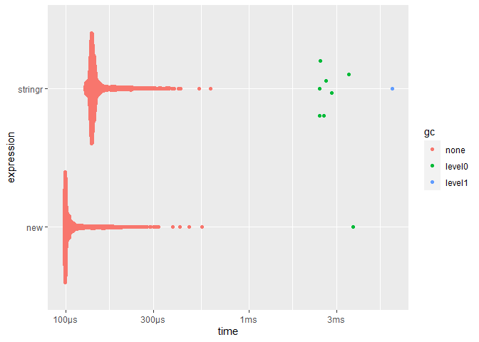
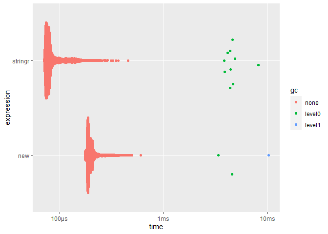
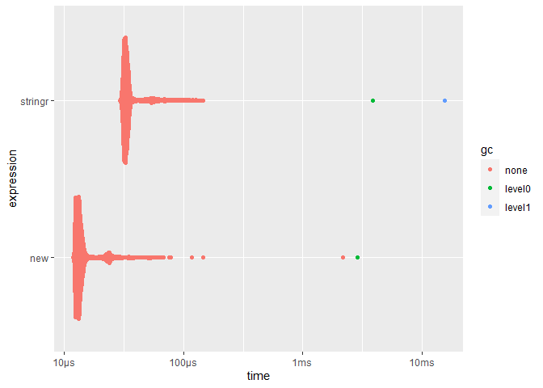
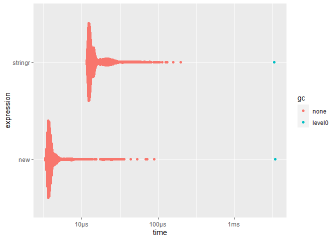
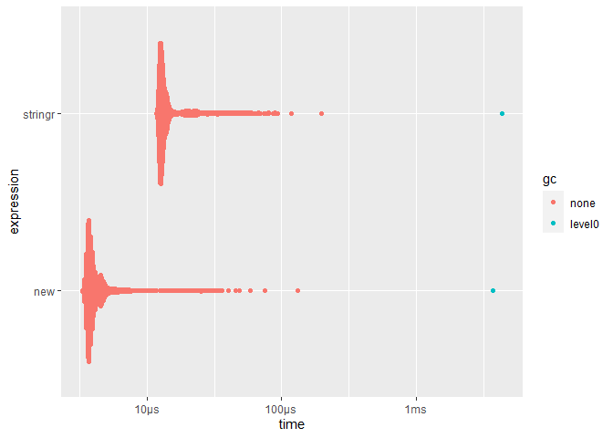

Benchmark of stringr replacement
================

- [Context](#context)
  - [Session info](#session-info)
  - [Helpers](#helpers)
- [Benchmarking](#benchmarking)
  - [`stringr::str_replace_all()`](#stringrstr_replace_all)
  - [`stringr::str_trim()`](#stringrstr_trim)
  - [`stringr::str_dup()`](#stringrstr_dup)
  - [`stringr::str_split()`](#stringrstr_split)
  - [`stringr::str_sub()`](#stringrstr_sub)

# Context

As part of [\#1549](https://github.com/yihui/knitr/issues/1549), we
removed **stringr** dependency by replacing all functions used with base
R equivalent.

This document aim to be a benchmark of each replacement. We’ll use
[**bench**](https://bench.r-lib.org/) to do the benchmark, and compare
**stringr** function with its replacement. Each benchmark will be done
in the context of there initial usage in **knitr**.

## Session info

``` r
xfun::session_info(c("knitr", "bench", "stringr"))
```

    ## R version 4.2.0 (2022-04-22 ucrt)
    ## Platform: x86_64-w64-mingw32/x64 (64-bit)
    ## Running under: Windows 10 x64 (build 22621), RStudio 2023.3.0.86
    ## 
    ## Locale: LC_COLLATE=French_France.utf8  LC_CTYPE=French_France.utf8    LC_MONETARY=French_France.utf8 LC_NUMERIC=C                   LC_TIME=French_France.utf8    
    ## 
    ## Package version:
    ##   bench_1.1.2     cli_3.6.0       evaluate_0.20   fansi_1.0.3     glue_1.6.2      graphics_4.2.0  grDevices_4.2.0 highr_0.10      knitr_1.41.9    lifecycle_1.0.3 magrittr_2.0.3 
    ##   methods_4.2.0   pillar_1.8.1    pkgconfig_2.0.3 profmem_0.6.0   rlang_1.0.6     stats_4.2.0     stringi_1.7.12  stringr_1.5.0   tibble_3.1.8    tools_4.2.0     utf8_1.2.2     
    ##   utils_4.2.0     vctrs_0.5.1     xfun_0.36       yaml_2.3.6

## Helpers

``` r
knitr_example = function(...) system.file('examples', ..., package = 'knitr')
```

# Benchmarking

## `stringr::str_replace_all()`

| Commit                                                                                     | PR                                                 | File                                                                                                                            |
|--------------------------------------------------------------------------------------------|----------------------------------------------------|---------------------------------------------------------------------------------------------------------------------------------|
| [9c92eff1](https://github.com/yihui/knitr/commit/9c92eff1f22b1e6c3bf5dc538dd8c0a2edc8ad48) | [\#2174](https://github.com/yihui/knitr/pull/2174) | [utils-vignettes.R#L158](https://github.com/yihui/knitr/blob/9c92eff1f22b1e6c3bf5dc538dd8c0a2edc8ad48/R/utils-vignettes.R#L158) |

Before:

``` r
x[!i] = stringr::str_replace_all(x[!i], p$inline.code, '') # remove inline code
```

After:

``` r
x[!i] = gsub(p$inline.code, '', x[!i], perl = TRUE) # remove inline code
```

``` r
file = knitr_example('knitr-minimal.Rnw')
x = xfun::read_utf8(file)
p = knitr:::detect_pattern(x, tolower(xfun::file_ext(file)))
p = knitr:::all_patterns[[p]]
p1 = p$chunk.begin; p2  = p$chunk.end
m = knitr:::group_indices(grepl(p1, x), grepl(p2, x))
i = m %% 2 == 0
```

``` r
res = bench::mark(
  stringr = stringr::str_replace_all(x[!i], p$inline.code, ''),
  new = gsub(p$inline.code, '', x[!i], perl = TRUE),
  min_time = Inf
)
summary(res, relative = TRUE)
```

    ## # A tibble: 2 × 6
    ##   expression   min median `itr/sec` mem_alloc `gc/sec`
    ##   <bch:expr> <dbl>  <dbl>     <dbl>     <dbl>    <dbl>
    ## 1 stringr     1.46   1.48      1         1.38      Inf
    ## 2 new         1      1         1.59      1         NaN

``` r
ggplot2::autoplot(res)
```

<!-- -->

## `stringr::str_trim()`

<table style="width:100%;">
<colgroup>
<col style="width: 35%" />
<col style="width: 20%" />
<col style="width: 43%" />
</colgroup>
<thead>
<tr class="header">
<th>Commit</th>
<th>PR</th>
<th>File</th>
</tr>
</thead>
<tbody>
<tr class="odd">
<td><a
href="https://github.com/yihui/knitr/commit/8fa7d1710bae72f9636ef64fa9286669329f1a9c">8fa7d17</a></td>
<td><a href="https://github.com/yihui/knitr/pull/2177">#2177</a></td>
<td><p><a
href="https://github.com/yihui/knitr/blob/8fa7d1710bae72f9636ef64fa9286669329f1a9c/R/parser.R#L491">parser.R#L491</a></p>
<p><a
href="https://github.com/yihui/knitr/blob/8fa7d1710bae72f9636ef64fa9286669329f1a9c/R/utils.R#L77">utils.R#L77</a></p></td>
</tr>
</tbody>
</table>

Before:

``` r
labels = stringr::str_trim(gsub(lab, '\\3', sapply(groups, `[`, 1)))
```

After:

``` r
x[!i] = gsub(p$inline.code, '', x[!i], perl = TRUE) # remove inline code
```

``` r
path = "https://raw.githubusercontent.com/yihui/knitr-examples/46c8d1db0cf0c9ab04432444079927324c4c3688/113-foo.R"
lines = xfun::read_utf8(path)
lab = knitr:::.sep.label
idx = cumsum(grepl(lab, lines))
groups = unname(split(lines, idx))
```

``` r
content = gsub(lab, '\\3', sapply(groups, `[`, 1))

res = bench::mark(
  stringr = stringr::str_trim(content),
  new = trimws(content),
  min_time = Inf
)
summary(res, relative = TRUE)
```

    ## # A tibble: 2 × 6
    ##   expression   min median `itr/sec` mem_alloc `gc/sec`
    ##   <bch:expr> <dbl>  <dbl>     <dbl>     <dbl>    <dbl>
    ## 1 stringr     1      1         2.42       Inf     9.67
    ## 2 new         2.46   2.37      1          NaN     1

``` r
ggplot2::autoplot(res)
```

<!-- -->

| Commit                                                                                    | PR                                                 | File                                                                                                      |
|-------------------------------------------------------------------------------------------|----------------------------------------------------|-----------------------------------------------------------------------------------------------------------|
| [8fa7d17](https://github.com/yihui/knitr/commit/8fa7d1710bae72f9636ef64fa9286669329f1a9c) | [\#2177](https://github.com/yihui/knitr/pull/2177) | [utils.R#L77](https://github.com/yihui/knitr/blob/8fa7d1710bae72f9636ef64fa9286669329f1a9c/R/utils.R#L77) |

Before:

``` r
stringr::str_trim(stringr::str_split(string, ';|,')[[1]])
```

After:

``` r
trimws(stringr::str_split(string, ';|,')[[1]])
```

``` r
string = ' .5,.6 , .7; .9 '
splitted = stringr::str_split(string, ';|,')[[1]]

res = bench::mark(
  stringr = stringr::str_trim(splitted),
  new = trimws(splitted),
  min_time = Inf
)
summary(res, relative = TRUE)
```

    ## # A tibble: 2 × 6
    ##   expression   min median `itr/sec` mem_alloc `gc/sec`
    ##   <bch:expr> <dbl>  <dbl>     <dbl>     <dbl>    <dbl>
    ## 1 stringr     1      1         2.37       Inf     10.7
    ## 2 new         2.41   2.45      1          NaN      1

``` r
ggplot2::autoplot(res)
```

<!-- -->

## `stringr::str_dup()`

| Commit                                                                                    | PR                                                 | File                                                                                                            |
|-------------------------------------------------------------------------------------------|----------------------------------------------------|-----------------------------------------------------------------------------------------------------------------|
| [1ce8286](https://github.com/yihui/knitr/commit/1ce82862b689338ce275269056ebfcc96eb975ca) | [\#2186](https://github.com/yihui/knitr/pull/2186) | [parser.R#L3488](https://github.com/yihui/knitr/blob/1ce82862b689338ce275269056ebfcc96eb975ca/R/parser.R#L3488) |

Before:

``` r
cat(' ', stringr::str_dup('~', getOption('width') - 10L), '\n')
```

After:

``` r
rep_str = function(x, n, sep = '') paste(rep(x, n), collapse = sep)
cat(' ', rep_str('~', getOption('width') - 10L), '\n')
```

``` r
res = bench::mark(
  stringr = stringr::str_dup('~', getOption('width') - 10L),
  new = paste(rep('~', getOption('width') - 10L), collapse = ''),
  min_time = Inf
)
summary(res, relative = TRUE)
```

    ## # A tibble: 2 × 6
    ##   expression   min median `itr/sec` mem_alloc `gc/sec`
    ##   <bch:expr> <dbl>  <dbl>     <dbl>     <dbl>    <dbl>
    ## 1 stringr     1      1         1.82      1         NaN
    ## 2 new         2.21   2.05      1         5.97      Inf

``` r
ggplot2::autoplot(res)
```

<!-- -->

## `stringr::str_split()`

<table style="width:100%;">
<colgroup>
<col style="width: 35%" />
<col style="width: 20%" />
<col style="width: 43%" />
</colgroup>
<thead>
<tr class="header">
<th>Commit</th>
<th>PR</th>
<th>File</th>
</tr>
</thead>
<tbody>
<tr class="odd">
<td><a
href="https://github.com/yihui/knitr/commit/67b973dc87c9d479cd5fbd76806e3a91f5e7d18c">67b973</a></td>
<td><a href="https://github.com/yihui/knitr/pull/2187">#2187</a></td>
<td><p><a
href="https://github.com/yihui/knitr/blob/67b973dc87c9d479cd5fbd76806e3a91f5e7d18c/R/pandoc.R#L125">pandoc.R#L125</a></p>
<p><a
href="https://github.com/yihui/knitr/blob/67b973dc87c9d479cd5fbd76806e3a91f5e7d18c/R/utils.R#L77">utils.R#L77</a></p></td>
</tr>
</tbody>
</table>

Before:

``` r
x = stringr::str_split(x, '\n')
```

After:

``` r
# patch strsplit() to split '' into '' instead of character(0)
str_split = function(x, split, ...) {
  y = strsplit(x, split, ...)
  y[x == ''] = list('')
  y
}

x = str_split(x, '\n')
```

``` r
con = url("https://raw.githubusercontent.com/yihui/knitr-examples/46c8d1db0cf0c9ab04432444079927324c4c3688/084-pandoc.pandoc")
x = read.dcf(con)
close(con)
x = x[!is.na(x)]
```

``` r
str_split = function(x, split, ...) {
  y = strsplit(x, split, ...)
  y[x == ''] = list('')
  y
}
res = bench::mark(
  stringr = stringr::str_split(x, '\n'),
  new = str_split(x, '\n'),
  min_time = Inf
)
summary(res, relative = TRUE)
```

    ## # A tibble: 2 × 6
    ##   expression   min median `itr/sec` mem_alloc `gc/sec`
    ##   <bch:expr> <dbl>  <dbl>     <dbl>     <dbl>    <dbl>
    ## 1 stringr     2.64   2.60      1         2.38      Inf
    ## 2 new         1      1         2.44      1         NaN

``` r
ggplot2::autoplot(res)
```

<!-- -->

## `stringr::str_sub()`

<table style="width:100%;">
<colgroup>
<col style="width: 35%" />
<col style="width: 19%" />
<col style="width: 44%" />
</colgroup>
<thead>
<tr class="header">
<th>Commit</th>
<th>PR</th>
<th>File</th>
</tr>
</thead>
<tbody>
<tr class="odd">
<td><a
href="https://github.com/yihui/knitr/commit/5a2cb72f63aa64b757418df99fc2ad3ef5292ac0">5a2cb72</a></td>
<td><a href="https://github.com/yihui/knitr/pull/2195">#2195</a></td>
<td><a
href="https://github.com/yihui/knitr/blob/5a2cb72f63aa64b757418df99fc2ad3ef5292ac0/R/utils-string.R">utils-string.R</a><br />
<a
href="https://github.com/yihui/knitr/blob/5a2cb72f63aa64b757418df99fc2ad3ef5292ac0/R/block.R#L564">block.R#L564</a><br />
<a
href="https://github.com/yihui/knitr/blob/5a2cb72f63aa64b757418df99fc2ad3ef5292ac0/R/utils.R#L92-L93">utils.R#L92-L93</a></td>
</tr>
</tbody>
</table>

Before:

``` r
stringr::str_sub(input, loc[i, 1], loc[i, 2]) = if (length(res)) {
      paste(hook(res), collapse = '')
    } else ''
```

After:

``` r
# replace parts of a string with new values; `pos` is a matrix of positions and
# each row is a pair of [start, end]
str_replace = function(x, pos, value) {
  if (length(x) != 1) stop("Only a character scalar is supported.")
  # extract parts of the string that are outside [start, end]
  m = rbind(pos[, 1] - 1, pos[, 2] + 1)
  m = matrix(c(1, m, nchar(x)), nrow = 2)
  y = substring(x, m[1, ], m[2, ])
  paste(rbind(y, c(value, '')), collapse = '')
}

str_replace(input, block$location, ans)
```

``` r
input = "inline `r (function() 1)()`"
location = matrix(c(8,27), ncol = 2, byrow = TRUE)
ans = "1"

str_replace = function(x, pos, value) {
  if (length(x) != 1) stop("Only a character scalar is supported.")
  # extract parts of the string that are outside [start, end]
  m = rbind(pos[, 1] - 1, pos[, 2] + 1)
  m = matrix(c(1, m, nchar(x)), nrow = 2)
  y = substring(x, m[1, ], m[2, ])
  paste(rbind(y, c(value, '')), collapse = '')
}

# wrapper to approximate what is done internally
old_replace = function(input, loc, ans) {
  stringr::str_sub(input, loc[1, 1], loc[1, 2]) = ans
  return(input)
}
```

``` r
res = bench::mark(
  stringr = old_replace(input, location, ans),
  new = str_replace(input, location, ans),
  min_time = Inf
)
summary(res, relative = TRUE)
```

    ## # A tibble: 2 × 6
    ##   expression   min median `itr/sec` mem_alloc `gc/sec`
    ##   <bch:expr> <dbl>  <dbl>     <dbl>     <dbl>    <dbl>
    ## 1 stringr     1      1         1.17       Inf     1   
    ## 2 new         1.19   1.21      1          NaN     1.71

``` r
ggplot2::autoplot(res)
```

<!-- -->

<table style="width:100%;">
<colgroup>
<col style="width: 34%" />
<col style="width: 19%" />
<col style="width: 45%" />
</colgroup>
<thead>
<tr class="header">
<th>Commit</th>
<th>PR</th>
<th>File</th>
</tr>
</thead>
<tbody>
<tr class="odd">
<td><a
href="https://github.com/yihui/knitr/commit/5a2cb72f63aa64b757418df99fc2ad3ef5292ac0">5a2cb72</a></td>
<td><a href="https://github.com/yihui/knitr/pull/2195">#2195</a></td>
<td><a
href="https://github.com/yihui/knitr/blob/5a2cb72f63aa64b757418df99fc2ad3ef5292ac0/R/header.R#L59-L60">header.R#L59-L60</a><br />
<a
href="https://github.com/yihui/knitr/blob/5a2cb72f63aa64b757418df99fc2ad3ef5292ac0/R/header.R#L90-L91">header.R#L90-L91</a></td>
</tr>
</tbody>
</table>

Before:

``` r
tmp = stringr::str_sub(doc[i], l[, 1], l[, 2])
stringr::str_sub(doc[i], l[,1], l[,2]) = paste0(tmp, '\n', make_header_html())
```

After :

``` r
tmp = substr(doc[i], l[, 1], l[, 2])
doc[i] = str_replace(doc[i], l, paste0(tmp, '\n', make_header_html()))
```

``` r
b = knitr::all_patterns$html$header.begin
doc = c("<head>", "<!--content-->", "</head>", "<body>", "</body>")
i = grep(b, doc)
l = stringr::str_locate(doc[i], b)
```

``` r
res = bench::mark(
  stringr = stringr::str_sub(doc[i], l[, 1], l[, 2]),
  new = substr(doc[i], l[, 1], l[, 2]),
  min_time = Inf
)
summary(res, relative = TRUE)
```

    ## # A tibble: 2 × 6
    ##   expression   min median `itr/sec` mem_alloc `gc/sec`
    ##   <bch:expr> <dbl>  <dbl>     <dbl>     <dbl>    <dbl>
    ## 1 stringr     3.38   3.20      1          Inf      Inf
    ## 2 new         1      1         3.18       NaN      NaN

``` r
ggplot2::autoplot(res)
```

<!-- -->

``` r
tmp = stringr::str_sub(doc[i], l[, 1], l[, 2])
header = knitr:::make_header_html()

old_fun = function(doc, l, tmp, header) {
  stringr::str_sub(doc[i], l[,1], l[,2]) = paste0(tmp, header)
  doc
}

new_fun = function(doc, l, tmp, header) {
  doc[i] = str_replace(doc[i], l, paste0(tmp, header))
  doc
}

res = bench::mark(
  stringr = old_fun(doc, l, tmp, header),
  new = new_fun(doc, l, tmp, header),
  min_time = Inf
)
summary(res, relative = TRUE)
```

    ## # A tibble: 2 × 6
    ##   expression   min median `itr/sec` mem_alloc `gc/sec`
    ##   <bch:expr> <dbl>  <dbl>     <dbl>     <dbl>    <dbl>
    ## 1 stringr     1      1         1.23       Inf     1   
    ## 2 new         1.21   1.20      1          NaN     1.63

``` r
ggplot2::autoplot(res)
```

<!-- -->

Before:

``` r
tmp = stringr::str_sub(doc[i], l[, 1], l[, 2])
stringr::str_sub(doc[i], l[,1], l[,2]) = paste0(tmp, make_header_latex(doc))
```

After :

``` r
tmp = substr(doc[i], l[, 1], l[, 2])
doc[i] = str_replace(doc[i], l, paste0(tmp, make_header_latex(doc)))
```

``` r
b = knitr::all_patterns$tex$header.begin
doc = c("\\documentclass[opt]{article}", "some tex content")
l = stringr::str_locate(doc[i], b)
```

``` r
res = bench::mark(
  stringr = stringr::str_sub(doc[i], l[, 1], l[, 2]),
  new = substr(doc[i], l[, 1], l[, 2]),
  min_time = Inf
)
summary(res, relative = TRUE)
```

    ## # A tibble: 2 × 6
    ##   expression   min median `itr/sec` mem_alloc `gc/sec`
    ##   <bch:expr> <dbl>  <dbl>     <dbl>     <dbl>    <dbl>
    ## 1 stringr     3.47   3.22      1          Inf     1   
    ## 2 new         1      1         3.21       NaN     3.21

``` r
ggplot2::autoplot(res)
```

<!-- -->

``` r
tmp = stringr::str_sub(doc[i], l[, 1], l[, 2])
header = knitr:::make_header_latex(doc)

old_fun = function(doc, l, tmp, header) {
  stringr::str_sub(doc[i], l[,1], l[,2]) = paste0(tmp, header)
  doc
}

new_fun = function(doc, l, tmp, header) {
  doc[i] = str_replace(doc[i], l, paste0(tmp, header))
  doc
}

res = bench::mark(
  stringr = old_fun(doc, l, tmp, header),
  new = new_fun(doc, l, tmp, header),
  min_time = Inf
)
summary(res, relative = TRUE)
```

    ## # A tibble: 2 × 6
    ##   expression   min median `itr/sec` mem_alloc `gc/sec`
    ##   <bch:expr> <dbl>  <dbl>     <dbl>     <dbl>    <dbl>
    ## 1 stringr     1      1         1.21       Inf     1   
    ## 2 new         1.21   1.24      1          NaN     2.48

``` r
ggplot2::autoplot(res)
```

<!-- -->
